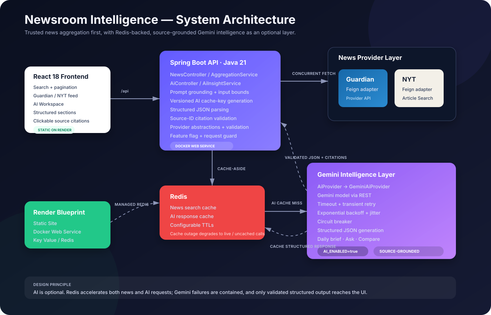

# AI-Powered News Intelligence Platform

A news search and reading app built with Java 21, Spring Boot, React, and Redis. It combines articles from The Guardian and The New York Times, with optional summaries, briefings, Q&A, and coverage comparison using Google Gemini.

## Features

- Search both publishers through one API.
- Fetch articles concurrently using Java 21 virtual threads and `CompletableFuture`.
- Normalize, deduplicate, sort, and paginate results.
- Cache news searches and AI responses in Redis.
- Return available results when one news provider fails.
- Generate briefings, summaries, and answers from the retrieved articles, with source links.
- Handle transient Gemini failures with timeouts, retries, and a circuit breaker.
- Enable or disable AI independently of news search.

## Architecture



If `AI_ENABLED=false`, Gemini is removed from the request path while Guardian + NYT search, pagination, Redis news caching, and the normal UI continue to work.

## AI features

The browser never calls Gemini directly and never receives the Gemini API key. React calls `/api/ai/*` on the Spring Boot backend.

Available operations:

- **Daily brief** — distinct key developments, optional additional stories, and only genuinely pending watch-next items from the current feed.
- **Ask the news** — answers grounded only in the supplied articles.
- **Compare coverage** — common ground and observable emphasis only when the current feed contains overlapping coverage across publishers.
- **Article summary** — concise grounded summary of one article.
- **Why it matters** — significance explained without unsupported speculation.

### Grounded prompt flow

For an AI request, articles are numbered before being sent to Gemini:

```text
[1]
Title: ...
Source: Guardian
Published: ...
Description: ...
URL: ...

[2]
Title: ...
Source: New York Times
...
```

Gemini is instructed to use only those supplied articles and return JSON in this shape:

```json
{
  "sections": [
    {
      "heading": "Key developments",
      "items": [
        {
          "text": "A grounded statement based on the current feed.",
          "sourceIds": [1, 2]
        }
      ]
    }
  ]
}
```

The backend then parses the JSON and removes any source ID that does not correspond to a supplied article.

### Structured API response

The API exposes both a compatibility `text` representation and the structured content used by the UI:

```json
{
  "text": "Key developments\n• A grounded statement [1][2]",
  "content": {
    "sections": [
      {
        "heading": "Key developments",
        "items": [
          {
            "text": "A grounded statement",
            "sourceIds": [1, 2]
          }
        ]
      }
    ]
  },
  "citations": [
    {
      "id": 1,
      "source": "Guardian",
      "title": "Example article",
      "url": "https://example.com/article"
    }
  ],
  "model": "gemini-3.6-flash",
  "cached": false
}
```

React renders the structured sections and turns validated citation IDs into clickable source links. The UI describes results as based on the current feed rather than implying independent fact verification.

## Redis-backed AI response cache

AI caching is separate from the existing news-search cache.

```text
AI request
    |
    v
build deterministic cache key
    |
    v
Redis: ai:insight:<key>
   / \
 hit  miss
 |      |
 v      v
return  Gemini
        |
        v
   validate response
        |
        v
   write to Redis
        |
        v
      return
```

AI cache keys include:

- prompt version,
- model identity,
- operation type (`brief`, `ask`, `compare`, etc.),
- article fingerprint,
- question fingerprint when applicable.

Article fingerprints use stable hashes of article URL/title/description, so identical requests can reuse the same generated result.

Default AI cache TTL is **30 minutes** and is configurable with `AI_CACHE_TTL`.

If Redis is unavailable, the AI feature degrades to an uncached Gemini request instead of failing solely because the cache is down.

## Gemini resilience

`GeminiAiProvider` calls the Gemini REST API through Spring `RestClient`.

The provider includes:

```text
Gemini request
     |
     v
connect/read timeout
     |
     v
transient failure?
  /       \
 no       yes
 |         |
 fail   retry with
        exponential backoff
        + random jitter
            |
            v
      failure threshold reached?
          /          \
        no            yes
        |              |
      retry       open circuit
                       |
                       v
              fail fast temporarily
```

Retries apply to transient conditions such as:

- HTTP `429`,
- HTTP `5xx`,
- network/resource access failures.

Non-transient client errors are not repeatedly retried.

Default settings:

- connection timeout: `5s`
- read timeout: `25s`
- retries: `2` after the initial attempt
- retry backoff: `400ms` base with exponential growth + jitter
- circuit failure threshold: `4`
- circuit open duration: `30s`

## Technology stack

| Area | Technology |
| --- | --- |
| Backend | Java 21, Spring Boot 3.5 |
| HTTP integrations | Spring Cloud OpenFeign, Spring `RestClient` |
| Concurrency | `CompletableFuture`, Java 21 virtual threads |
| Caching | Spring Cache, Redis, `StringRedisTemplate` |
| AI | Google Gemini behind `AiProvider` abstraction |
| AI response handling | Jackson structured JSON parsing + source validation |
| Frontend | React 18, Axios |
| Validation / health | Bean Validation, Spring Boot Actuator |
| Build | Gradle, npm |
| Packaging | Docker multi-stage build |
| Deployment | Render Static Site, Docker Web Service, Render Key Value |
| CI option | Jenkins |

## Design choices and patterns

### Strategy pattern — news providers

```java
public interface NewsProviderClient {
    String getProviderName();
    NewsApiResult search(String keyword, int page, int pageSize);
}
```

`GuardianClient` and `NytClient` implement the same contract, so `AggregationService` is not coupled to one publisher.

### Adapter pattern — normalized domain model

Guardian and NYT payloads are adapted to:

```java
public record NewsArticle(
    String title,
    String description,
    String url,
    String source,
    String publishedAt,
    String imageUrl
) {}
```

The rest of the application works with this model rather than provider-specific JSON.

### Fan-out / fan-in

Guardian and NYT requests run concurrently. The backend waits for available provider results, then merges, normalizes, deduplicates, sorts, and paginates them.

### Cache-aside

News and AI requests check Redis first. Cache misses call the provider and store the result.

### AI provider abstraction

```java
public interface AiProvider {
    String generate(String systemPrompt, String userPrompt);
    String modelName();
    boolean isConfigured();
}
```

`GeminiAiProvider` owns Gemini-specific HTTP details. `AiInsightService` owns the application-level AI use cases, grounding, cache-key generation, structured parsing, and citation validation.

## AI request and response validation

The backend applies:

- article content treated as untrusted prompt data,
- bounded article title/description/URL/question lengths,
- explicit instruction to use only supplied evidence,
- low generation temperature for more stable output,
- JSON response MIME type requested from Gemini,
- structured response parsing before data reaches React,
- invalid/unknown source IDs removed by the backend,
- publisher/title/URL citation metadata built by the backend rather than invented by the model,
- application-side AI request-per-minute guard,
- server-side API key only,
- AI feature flag for graceful shutdown.

Gemini receives the current feed directly as context. The project does not use embeddings or a vector database.

## Repository structure

```text
ai-powered-news-intelligence/
├── backend/
│   ├── Dockerfile
│   ├── build.gradle
│   └── src/
│       ├── main/java/com/example/news/
│       │   ├── ai/
│       │   │   ├── AiInsightService.java
│       │   │   ├── AiProvider.java
│       │   │   ├── AiResponse.java
│       │   │   ├── AiResponseCache.java
│       │   │   ├── GeminiAiProvider.java
│       │   │   └── RedisAiResponseCache.java
│       │   ├── client/
│       │   │   ├── guardian/
│       │   │   └── nyt/
│       │   ├── config/
│       │   ├── controller/
│       │   ├── model/
│       │   └── service/
│       ├── main/resources/application.yaml
│       └── test/
├── frontend/
│   └── src/features/
│       ├── news/
│       └── ai/
├── docs/
│   └── architecture.svg
├── Jenkinsfile
└── render.yaml
```

## Run locally

### Prerequisites

- Java 21
- Node.js 22
- Redis on port `6379`
- Guardian API key
- NYT API key
- Gemini API key when AI is enabled

At least one news-provider key is required. Configure both to retrieve articles from both publishers.

### Environment variables

Windows PowerShell:

```powershell
$env:GUARDIAN_API_KEY="your-guardian-key"
$env:NYT_API_KEY="your-nyt-key"
$env:GEMINI_API_KEY="your-gemini-key"
$env:GEMINI_MODEL="gemini-3.6-flash"
$env:AI_ENABLED="true"
$env:AI_REQUESTS_PER_MINUTE="15"
$env:AI_CACHE_TTL="30m"
$env:GEMINI_CONNECT_TIMEOUT="5s"
$env:GEMINI_READ_TIMEOUT="25s"
$env:GEMINI_MAX_RETRIES="2"
$env:GEMINI_RETRY_BACKOFF="400ms"
$env:GEMINI_CIRCUIT_FAILURE_THRESHOLD="4"
$env:GEMINI_CIRCUIT_OPEN_DURATION="30s"
$env:REDIS_URL="redis://localhost:6379"
```

macOS/Linux:

```bash
export GUARDIAN_API_KEY="your-guardian-key"
export NYT_API_KEY="your-nyt-key"
export GEMINI_API_KEY="your-gemini-key"
export GEMINI_MODEL="gemini-3.6-flash"
export AI_ENABLED="true"
export AI_REQUESTS_PER_MINUTE="15"
export AI_CACHE_TTL="30m"
export GEMINI_CONNECT_TIMEOUT="5s"
export GEMINI_READ_TIMEOUT="25s"
export GEMINI_MAX_RETRIES="2"
export GEMINI_RETRY_BACKOFF="400ms"
export GEMINI_CIRCUIT_FAILURE_THRESHOLD="4"
export GEMINI_CIRCUIT_OPEN_DURATION="30s"
export REDIS_URL="redis://localhost:6379"
```

Do not commit real API keys to source control.

### Start backend

Windows:

```powershell
cd backend
.\gradlew.bat bootRun
```

macOS/Linux:

```bash
cd backend
./gradlew bootRun
```

Health:

```text
http://localhost:8080/actuator/health
```

AI status:

```text
http://localhost:8080/api/ai/status
```

### Start frontend

```bash
cd frontend
npm ci
npm start
```

Open:

```text
http://localhost:3000
```

The React development proxy forwards `/api` requests to the Spring Boot backend.

### Disable AI

```powershell
$env:AI_ENABLED="false"
```

Restart the backend. Search and news browsing remain available while the AI workspace reports Offline.

## API examples

### Search news

```http
GET /api/news?keyword=java&page=1&pageSize=12
```

### AI status

```http
GET /api/ai/status
```

```json
{
  "enabled": true
}
```

### Daily brief

```http
POST /api/ai/brief
Content-Type: application/json
```

```json
{
  "articles": [
    {
      "title": "Example headline",
      "description": "Example description",
      "url": "https://example.com/story",
      "source": "Guardian",
      "publishedAt": "2026-09-16T10:00:00Z",
      "imageUrl": null
    }
  ]
}
```

### Ask the news

```http
POST /api/ai/ask
Content-Type: application/json
```

```json
{
  "question": "What are the biggest technology developments in this feed?",
  "articles": [
    {
      "title": "...",
      "description": "...",
      "url": "...",
      "source": "Guardian",
      "publishedAt": "...",
      "imageUrl": null
    }
  ]
}
```

### Compare coverage

```http
POST /api/ai/compare
Content-Type: application/json
```

The React application constructs these payloads from the current feed automatically.

## Configuration

| Variable | Default | Purpose |
| --- | --- | --- |
| `GUARDIAN_API_KEY` | empty | Guardian API authentication |
| `NYT_API_KEY` | empty | NYT API authentication |
| `GEMINI_API_KEY` | empty | Backend-only Gemini authentication |
| `GEMINI_MODEL` | `gemini-3.6-flash` | Gemini model |
| `AI_ENABLED` | `true` | AI feature switch |
| `AI_REQUESTS_PER_MINUTE` | `15` | Application-side AI request guard |
| `AI_CACHE_TTL` | `30m` | Redis AI response cache TTL |
| `GEMINI_CONNECT_TIMEOUT` | `5s` | Gemini connection timeout |
| `GEMINI_READ_TIMEOUT` | `25s` | Gemini response timeout |
| `GEMINI_MAX_RETRIES` | `2` | Transient retries after initial attempt |
| `GEMINI_RETRY_BACKOFF` | `400ms` | Base retry backoff |
| `GEMINI_CIRCUIT_FAILURE_THRESHOLD` | `4` | Consecutive transient failures before opening circuit |
| `GEMINI_CIRCUIT_OPEN_DURATION` | `30s` | Circuit open duration |
| `REDIS_URL` | `redis://localhost:6379` | Redis connection |
| `NEWS_CACHE_TTL` | `30m` | Search result cache TTL |
| `NEWS_CONNECT_TIMEOUT_MS` | `10000` | News provider connection timeout |
| `NEWS_READ_TIMEOUT_MS` | `20000` | News provider read timeout |
| `NEWS_PROVIDER_TIMEOUT` | `35s` | Overall news-provider task timeout |
| `CORS_ALLOWED_ORIGINS` | `http://localhost:3000` | Allowed browser origin |
| `SWAGGER_ENABLED` | `false` | Swagger UI toggle |

## Failure behavior

| Failure | Behavior |
| --- | --- |
| Guardian fails | NYT results can still be returned |
| NYT fails | Guardian results can still be returned |
| Both news providers fail | API returns a clear service-unavailable response |
| Redis unavailable for news | Live provider calls continue |
| Redis unavailable for AI | AI falls back to an uncached Gemini request |
| Gemini returns `429`, `5xx`, or network failure | Retry with exponential backoff + jitter |
| Gemini repeatedly fails transiently | Circuit opens temporarily and requests fail fast |
| Gemini returns malformed structured content | Backend rejects the invalid AI response |
| Gemini returns unknown citation IDs | Invalid source IDs are removed before response |
| `AI_ENABLED=false` | AI is offline; core news remains available |
| Missing Gemini key | AI status is disabled; the key is never exposed to React |

## Tests and builds

Backend tests:

```bash
cd backend
./gradlew test
```

Frontend production build:

```bash
cd frontend
npm ci
npm run build
```

## Docker

Build the backend image:

```bash
cd backend
docker build -t news-intelligence-api .
```

Redis remains external to the image so the same backend can use local Redis or Render Key Value.

## Render deployment

The root `render.yaml` defines:

| Service | Render type | Purpose |
| --- | --- | --- |
| `abhay123abhi-news-web` | Static Site | React build and `/api/*` rewrite |
| `abhay123abhi-news-api` | Docker Web Service | Spring Boot API |
| `abhay123abhi-news-cache` | Key Value | Redis-compatible cache for news + AI responses |

Add these secrets/configuration values in Render as required:

```text
GUARDIAN_API_KEY=...
NYT_API_KEY=...
GEMINI_API_KEY=...
AI_ENABLED=true
GEMINI_MODEL=gemini-3.6-flash
AI_CACHE_TTL=30m
```

The frontend uses the backend `/api/*` path and does not contain third-party API secrets.
